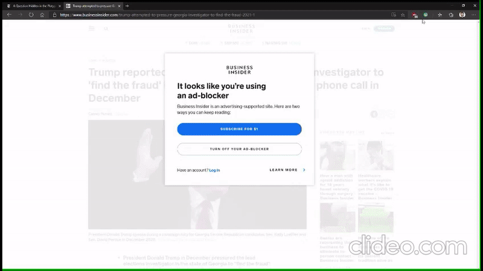
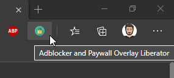

# Adblocker and Paywall Overlay Liberator

Chromium Extension (compatible with `Google Chrome` and `Microsoft Edge`)

Removes style definitions that are commonly used to display a paywall.

- Specific rules to remove overlays on:
  - https://www.businessinsider.com
  - https://www.nytimes.com
  - https://www.washingtonpost.com
  - https://www.usatoday.com
  - https://weather.com

 

## Getting Started
1. Clone the or fork the repo.
2. Browse to `edge://extensions/`
3. Toggle on `Developer mode`
4. Click `Load unpacked`
5. Select the `_src` folder from the repo.
6. Confirm the icon is available:
   
   
 

